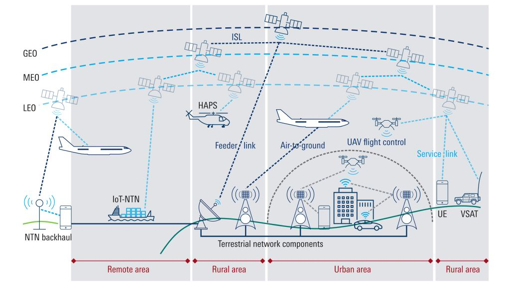

6G, the envisioned next generation of wireless communication technology, promises unprecedented levels of connectivity, speed, and reliability. It aims to surpass the capabilities of 5G with dramatically higher data rates, ultra-low latency, and the ability to support a massive surge in connected devices. This enhanced network infrastructure will be pivotal for enabling futuristic applications like real-time immersive experiences and large-scale automation. One crucial aspect of 6G is the integration of Non-Terrestrial Networks (NTNs)

### Non-Terrestrial Networks (NTNs)

NTNs refer to (segments of) networks operating through an air/spaceborne vehicle for communication. They are crucial for extending communication capabilities to remote or inaccessible areas where traditional terrestrial infrastructure is impractical or unavailable. They play a vital role in providing global connectivity, supporting applications ranging from internet access in rural or underserved regions to critical communication links for maritime, aviation, and military operations.
These networks are characterized by their ability to offer wide coverage areas, rapid deployment capabilities, and resilience to natural disasters or infrastructure damage. Some examples of devices used are:

* Satellites: These celestial workhorses offer immense potential for bridging the digital divide, delivering connectivity to even the most remote and underserved geographical areas. Imagine connecting individuals in sparsely populated regions or providing emergency communication channels during natural disasters.
* High-altitude Platforms (HAPs): These are essentially unmanned aerial vehicles (UAVs) that operate at significantly higher altitudes. HAPs offer localized coverage over specific regions, making them ideal for applications like smart agriculture, precision farming, and providing connectivity in high-demand areas during events or gatherings.
* Unmanned Aerial Vehicles (UAVs): Commonly known as drones, UAVs can be dynamically deployed to cater to temporary needs or act as mobile hotspots in disaster zones or remote locations. They offer a flexible and adaptable solution for situations where fixed infrastructure is impractical.

### 6G
The sixth generation of cellular network technology. This collaborative effort, spearheaded by companies, research institutes, and even countries around the globe, aspires to redefine the way we connect and interact with the world. While still in its formative stages, 6G holds the potential to revolutionize communication by offering a multitude of advancements. To know more you can visit [6G-NTN Project](https://www.6g-ntn.eu/about-6g-ntn/)
While still under development, 6G promises to redefine the way we interact with the world through a set of defining characteristics:

* Unprecedented Speed and Capacity: Imagine downloading entire movie libraries in seconds or transferring massive datasets with lightning-fast speed. This is precisely what 6G envisions, aiming to achieve exponentially higher data rates compared to its predecessor, 5G. This opens doors to a plethora of applications, such as real-time, immersive experiences in virtual and augmented reality, seamless streaming of ultra-high-definition content, and cloud-based services accessible at the blink of an eye.

* Ultra-Low Latency: Latency, the time it takes for data to travel between points, is poised to plummet with 6G. We can envision near-instantaneous responses in applications like remote collaboration, enabling real-time control of critical infrastructure with unparalleled responsiveness. This also paves the way for autonomous vehicles with lightning-fast decision-making capabilities and even precise remote surgery performed by specialists miles away, blurring the lines between physical and virtual presence.

* Enhanced Security and Reliability: Security is paramount in 6G's vision. 6G aspires to be a fortress of information security, safeguarding sensitive data through robust security protocols. Additionally, improved network resilience will ensure that critical communications remain operational even during disruptions, fostering a sense of trust and reliability. Furthermore, seamless redundancy mechanisms will provide backup pathways, further bolstering network reliability and ensuring the uninterrupted flow of information.

* Improved Spectral Efficiency: As the number of devices connecting to the network continues to surge, 6G prioritizes efficient utilization of the radio spectrum. This involves optimizing the way data travels through this finite resource, allowing more devices and services to operate concurrently without compromising performance. This efficient spectrum usage ensures that everyone has the potential to enjoy the benefits of 6G connectivity without experiencing slowdowns or congestion.

* Integration with Non-Terrestrial Networks (NTNs): While traditional cellular networks rely on terrestrial infrastructure like cell towers, 6G envisions seamless integration with NTNs. These networks utilize platforms like satellites, high-altitude platforms (HAPs), and unmanned aerial vehicles (UAVs) to extend network reach into remote areas, provide robust connectivity for disaster resilience, and support emerging applications that demand continuous connectivity beyond the limits of traditional networks.

These defining characteristics, combined with ongoing research and collaborative efforts, position 6G as a transformative force in shaping the future of communication. From enabling cutting-edge applications to bridging the digital divide, 6G holds the potential to revolutionize our world and unlock a future of ubiquitous, reliable, and hyper-connected experiences.

### The Road Ahead: Challenges and Opportunities

While the 6G journey has begun, several challenges lie ahead:

* Standardization: Establishing global standards for various aspects of the technology is crucial for ensuring seamless communication across diverse networks and avoiding fragmentation.
* Infrastructure Development: Deploying the necessary infrastructure, including advancements in antenna technology and network architecture, requires significant investment and collaboration.
* Security Concerns: As with any new technology, ensuring robust security measures and addressing potential vulnerabilities is critical.

### References
M. Giordani and M. Zorzi, "Non-Terrestrial Networks in the 6G Era: Challenges and Opportunities,”
in IEEE Network, vol. 35, no. 2, pp. 244-251, Mar. 2021.

